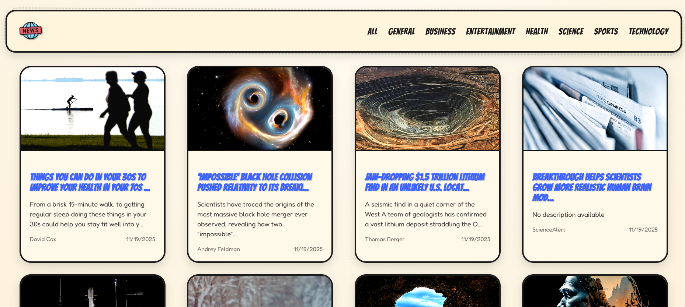

# 🗞️ News-App – Real-Time News App (React + Vite + Vercel)

🔗 **Live Preview:**  
https://news-app-delta-kohl.vercel.app/

---



---

## ⭐ About the Project
**NewsFlash** is a fast, modern and visually stunning real-time News Application built using **React + Vite**.

It uses a **Vercel Serverless API Route** (`/api/news.js`) to fetch NewsAPI data securely — this completely solves the **CORS issue** that normally breaks NewsAPI on production.

The UI is designed in a **Vintage × Comic × Superhero** theme with POW animations, comic borders, wobble effects, retro textures and complete responsiveness.

---

## 🚀 Tech Stack

| Layer      | Technology |
|------------|------------|
| Frontend   | React + Vite |
| Styling    | Custom CSS (Vintage + Comic UI) |
| Backend    | Vercel Serverless Functions |
| API        | NewsAPI.org |
| HTTP       | Axios |
| Hosting    | Vercel |

---

## 🎯 Features

### 🎨 UI Highlights
- Superhero comic-style cards  
- POW! hover effect  
- Vintage paper textures  
- Wobble border animation  
- Responsive grid layout  
- Retro grain overlay  
- Smooth hover transitions  

### 📰 News Features
- Live news fetching  
- Category-wise filtering  
- Latest “Everything” mode  
- Fallback image support  
- Clean date formatting  
- Proper error handling  

### ⚡ Performance
- Vite fast development  
- Optimized CSS  
- Serverless backend = no CORS issues  
- No build warnings  

---

## 📁 Folder Structure

```
news-app/
│
├── api/
│   └── news.js
│
├── public/
│   ├── news_logo.png
│   └── Screenshot.png
│
├── src/
│   ├── App.jsx
│   ├── App.css
│   ├── main.jsx
│   │
│   ├── components/
│   │   ├── Navbar.jsx
│   │   ├── Home.jsx
│   │   ├── Card.jsx
│   │   └── Footer.jsx
│
├── .env
├── index.html
├── vite.config.js
└── package.json
```

---

## 🔌 Environment Variable

Create a `.env` file:

```
VITE_NEWS_API_KEY=your_newsapi_key
```

Also add the same key in:

```
Vercel → Project Settings → Environment Variables
```

Then **redeploy**.

---

## 🛠️ Vercel Serverless API Route (CORS FIX)

`/api/news.js`

```js
export default async function handler(req, res) {
  const API_KEY = process.env.VITE_NEWS_API_KEY;
  const category = req.query.category || "everything";

  let link = "";

  if (category === "everything") {
    link = `https://newsapi.org/v2/everything?q=latest&language=en&sortBy=publishedAt&apiKey=${API_KEY}`;
  } else {
    link = `https://newsapi.org/v2/top-headlines?country=us&category=${category}&apiKey=${API_KEY}`;
  }

  try {
    const response = await fetch(link);
    const data = await response.json();
    return res.status(200).json({ articles: data.articles || [] });
  } catch (err) {
    return res.status(500).json({ articles: [] });
  }
}
```

---

## 🚀 Deployment (Vercel)

1. Push your project to GitHub  
2. Open **vercel.com** → Import repo  
3. Add environment variable:  
   ```
   VITE_NEWS_API_KEY
   ```
4. Deploy  
5. Done 🎉  

---

## ❤️ Author
Built with passion by **Vansh Gaikwad**.  
If you like this project, don’t forget to ⭐ it!
